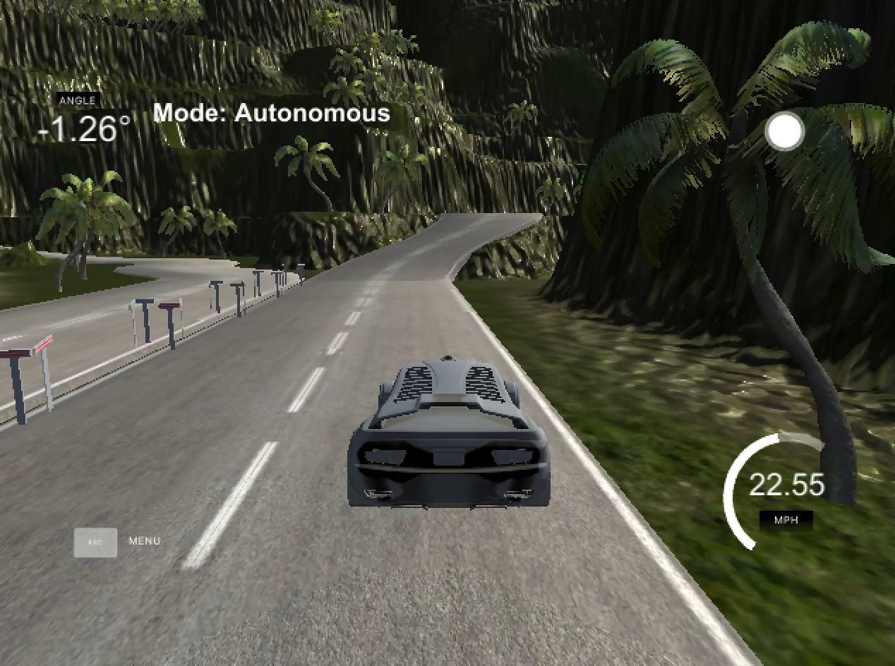
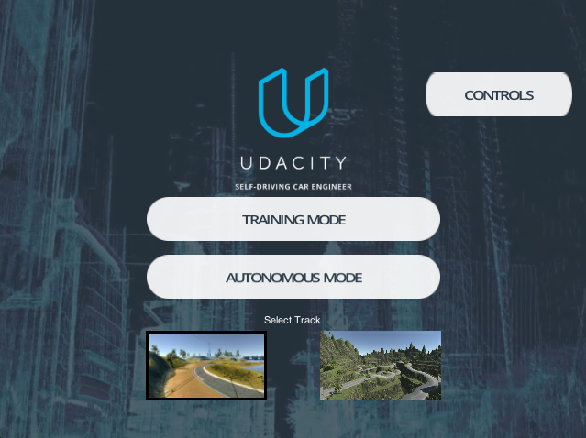
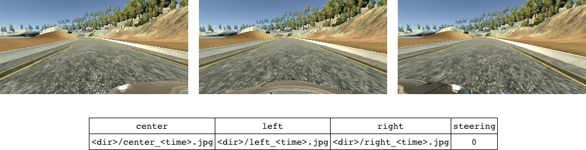
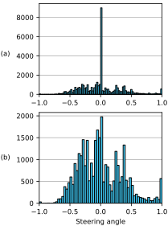
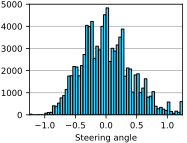
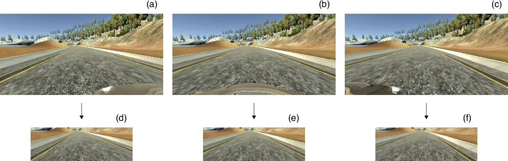
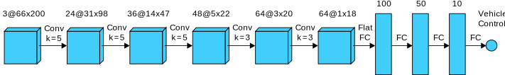
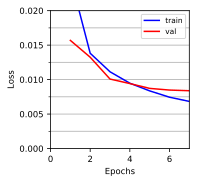

## Vehicle Steering Angle Prediction using ConvNets
This project consists of designing, training, and evaluating an end-to-end convolutional neural network (CNN) pipeline to perform the steering of a self-driving car. A simulator provided by Udacity was used to collect training data and to test the performance. Click on the image below for a video of the car driving in autonomous mode. A write-up is also available [www.lrgonzales.com/steering-angle-pred](http://www.lrgonzales.com/steering-angle-pred).

### Introduction
The steering of a vehicle is a complex problem faced by self-driving vehicles, particularly given the various colors and patterns of lane markings present in the real-world. In addition, lane markings can be obscured by obstacles and wear and tear. Moreover, it's possible that lanes/pathways don't contain any markings and are expected to be inferred (one-way streets, alleyways, etc). It's also critical that a system designed to perform the steering of a self-driving car be robust to varied weather, road surfaces, and lighting conditions. CNNs are an attractive solution to this task given their ability to learn abstract concepts.

### Simulator
A simulator (startup screen shown in Fig. 1) provided by Udacity (download for [Linux](https://d17h27t6h515a5.cloudfront.net/topher/2017/February/58ae46bb_linux-sim/linux-sim.zip), [Mac](https://d17h27t6h515a5.cloudfront.net/topher/2017/February/58ae4594_mac-sim.app/mac-sim.app.zip), [Windows](https://d17h27t6h515a5.cloudfront.net/topher/2017/February/58ae4419_windows-sim/windows-sim.zip)) was used to collect training data in training mode and to test the performance of the CNN in autonomous mode.

  

  
Fig. 1: Start up screen of Udacity simulator.

In training mode, all controls (steering, throttle, brake) are passed to the user. Steering angles are in [-25.0°, 25.0°] and speed is limited to 30 MPH. There are three emulated cameras (left, center, right) within the vehicle that save images (320 x 160 resolution) at regular time intervals to a user-specified file directory. In addition, a CSV file is created where each row contains the path to a set of three image captures and the corresponding steering angle at the time of capture. An example of a saved capture with a steering angle label of 0° is shown in Fig. 2 with an abbreviated example of the corresponding CSV file entry below. Note that the CSV contains normalized angles ([-25.0°, 25.0°] ↦ [-1.0, 1.0]). In autonomous mode, vehicle speed is maintained to a modifiable constant and the saved CNN model controls the steering angle.

  

  
Fig. 2: Example capture in training mode of left, center, and right cameras.

The simulator contains two tracks. The first track is generally less challenging given that the road is a one-way and only has a couple of sharp turns. Perhaps the most challenging section is a cobblestone bridge with no explicit lane markings other than guardrails on either side. The second track contains a more varied terrain comprised of a two-way, mountainous road with numerous sharp turns, steep gradients, and roadside cliffs. Both tracks are featured in the video above.

### Dataset
With the simulator in training mode, each track was driven twice in the default direction of traffic. To prevent overfitting and to generally have more data to train and validate on, each track was driven twice in the opposite direction as well. Given that the majority of time is spent driving straight (0°) and in flat terrain, additional data was captured in sections with sharp turns and/or steep gradients. To ensure that the network had the most reliable data to learn (and validate) from, an analog joystick was used when driving around the tracks, as opposed to keyboard controls, which often lead to a jerky response.

Fig. 3(a) shows a histogram of the steering angle data collected in training mode. The high count of steering angles equal to 0° is a result of the two tracks containing long stretches of straight roadway. If this data were fed directly into the CNN during training, it's likely that the trained model would have a bias towards 0°. To alleviate this issue, data samples with a steering angle label equal to 0° were downsampled by approximately one-fifth. A histogram of the resulting dataset is shown in Fig. 3(b).

  

  
Fig. 3: Histogram of the data collected   in training mode before (a) and   after (b) downsampling.

Using only the center camera for prediction (architecture discussed later) might suggest that only center camera images be used for training. However, it is possible to use the left and right camera images to represent what's referred to as recovery data. Similar to a human learning to recover after veering from the center of a lane, recovery data trains the CNN what to do in the event it finds itself off-center. For example, if Fig. 5(d) (cropping discussed later), an image from the left camera, were actually captured by the center camera, the corresponding steering angle should represent a corrective angle to the right. Similarly, Fig. 5(f) would require the opposite corrective action. To implement this, images from the left and right camera should have their corresponding labels include a correction factor. This approach was described in a 2016 paper by NVIDIA [1] and effectively triples the training data while implicitly including recovery data. If recovery data were not available implicitly through the left and right cameras, it would have to be collected explicitly.

Fig. 4 shows a histogram of the data from Fig. 3(b) after it has undergone the augmentation of recovery data as described above. This resulting dataset is subsequently split to create a training set and a validation set.

  

  
Fig. 4: Histogram of the final dataset   with recovery data.

### CNN Architecture and Training
In addition to the common normalization scheme for images ([0, 255] ↦ [0, 1.0]), cropping and resizing were also implemented as part of preprocessing. Specifically, the top 55 pixels and bottom 25 pixels were cropped and the resulting image was resized to 200 x 66 [1]. Cropping allows for the CNN to focus on the most relevant content without having to learn superfluous information (sky, scenery, etc). Perhaps more importantly, cropping and resizing result in smaller activation layers and thus fewer CNN parameters, leading to quicker processing in real-time applications. Fig. 5 shows the cropping and resizing that would be performed on the example capture from Fig. 2.

  

  
Fig. 5: Cropping and resizing performed on set of images in Fig. 2.

The CNN architecture is borrowed from NVIDIA [1], has a total of 252,219 trainable parameters, and takes in a single image as input (center camera). A complete diagram of the architecture, depicting the activation layers, is shown below with the preprocessing layers omitted for brevity. The architecture from comma.ai [2] was considered but resulted in nearly seven times as many trainable parameters.

  

  
Fig. 6: CNN architecture borrowed from NVIDIA.

The learning rate and batch size were treated as hyperparameters during the training process. The model was trained using RMS loss and the Adam optimizer.

  

  
Fig. 7: Training and validation loss.

### Performance
Given the nature of the task at hand, a test set metric was not captured. Instead, driving performance was visually inspected in autonomous mode. The model successfully completes both tracks at a speed of 20 MPH.

### Future Work
Because the solution is expected to perform in real-time within a self-driving car, further efforts could be made in terms of exploring CNN architectures, particularly residual networks, with fewer parameters, easing processing requirements. It would also be interesting to see if performing a perspective transform within the cropped region leads to improvements. Lastly, there may be benefits in using two (left and right) or all three camera inputs into the CNN architecture; however, recovery data would have to be explicitly collected.

### Usage
Run `./init.sh` to obtain the dataset in `./data/` and the saved TensorFlow model in `./tf_model/`.

#### Training
Run `python ./src/sign_classifier_train.py` to train the model. The trained TensorFlow model saves to `./tf_model/`. the chosen values for The chosen values for the hyperparameters (learning rate and batch size) are predefined in `./src/sign_classifier_train.py`, but these can be changed by redefining `alpha` and `batch_sz`.

#### Inference
Inference can be performed by running `python ./src/sign_classifier_inference.py ` where `` is a 32 x 32 RGB image compatible with `cv2.imread()`. As an example, `twenty_kph.png`, a compatible image of a 20 KPH speed limit sign, is included in `./imgs/`. To perform inference on this image, run `python ./src/sign_classifier_inference.py ./imgs/twenty_kph.png`.

### Dependencies
The project makes use of `numpy`, `matplotlib`, `tensorflow`, `cv2`, and `gdrive`.
